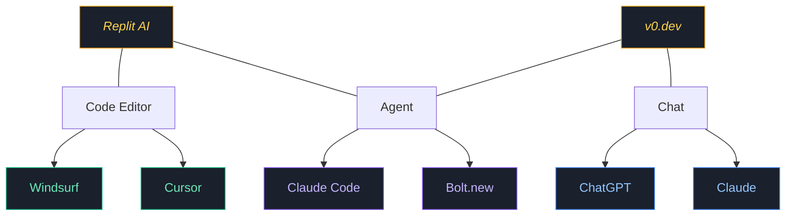

# Popular AI Tools

  
🔄

  
Many tools cross categories or offer features from multiple categories

  
📈

  
The AI coding landscape is rapidly evolving with new tools emerging constantly

  
💵

  
Tools are generally becoming more accessible and affordable over time

