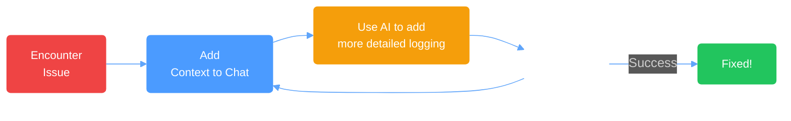

# Strategy: AI Powered Debugging {.text-center}

  

    
🐛

    
Identify Issue to Solve

  

  
  

    
🤖

    
Add Error Logs + Context to AI

  

  

    
📝

    
Request AI to Add more Detailed Logs

  

  

    
✅

    
Verify Fix

  

  Pro tip: Use agent mode for automated debugging cycles

