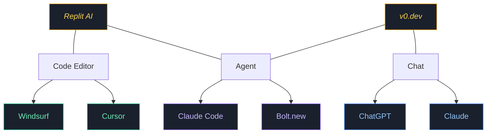

---theme: seriph
title: Introduction to AI Coding - Headstart
info: |
  Best practices for AI powered coding
class: text-center
drawings:
  persist: false
transition: slide-left
mdc: true
highlighter: shiki
lineNumbers: false
colorSchema: dark
css: unocss
background: https://source.unsplash.com/collection/94734566/1920x1080
fonts:
  sans: 'Inter'
  mono: 'Fira Code'
layout: cover
---

# Introduction to AI Coding

Best practices for AI powered coding

<!--
The last comment block of each slide will be treated as slide notes. It will be visible and editable in Presenter Mode along with the slide. [Read more in the docs](https://sli.dev/guide/syntax.html#notes)
-->

---
transition: slide-up
layout: default
class: text-center
---

# Why Use AI Coding Tools?

  
💻

  

    
Faster Development

    
Spend less time writing code

  

  
🎨

  

    
UI/UX Generation

    
Create interfaces with natural language

  

  
📄

  

    
Documentation & Tests

    
Automatically generate comprehensive docs

  

  
🔍

  

    
Documentation Search

    
Auto search through developer resources

  

  
📱

  

    
Code-Free Apps

    
Generate apps without coding with <a href="https://madewithclaude.com/" target="_blank" class="text-blue-400">Claude Artifacts</a>

  

  
📊

  

    
Create Presentations

    
Build slides like this one with <a href="https://sli.dev" target="_blank" class="text-blue-400">Sli.dev</a>

  

  
📝

  

    
Class Notes

    
Take notes with <a href="https://www.markdownguide.org" target="_blank" class="text-blue-400">Markdown</a> or <a href="https://github.com/James-Yu/latex-workshop/wiki/Install" target="_blank" class="text-blue-400">LaTeX</a>

  

  
💡

  

    
Vibe Coding

    
Just write prompts and see where it takes you

  

::right::

  
📱

  

    
Code-Free Apps

    
Generate apps without coding with <a href="https://madewithclaude.com/" target="_blank" class="text-blue-400">Claude Artifacts</a>

  

  
📊

  

    
Create Presentations

    
Build slides like this one with <a href="https://sli.dev" target="_blank" class="text-blue-400">Sli.dev</a>

  

  
📝

  

    
Class Notes

    
Take notes with <a href="https://www.markdownguide.org" target="_blank" class="text-blue-400">Markdown</a> or <a href="https://github.com/James-Yu/latex-workshop/wiki/Install" target="_blank" class="text-blue-400">LaTeX</a>

  

  
💡

  

    
Vibe Coding

    
Just write prompts and see where it takes you

  

---
transition: slide-up
layout: default
---

# Current Landscape: Categories

Three main categories of AI tools

  <h3 class="text-lg font-bold text-blue-400">Chat</h3>
  
Simple chat interface with optional code execution capabilities directly in the chat environment

  <h3 class="text-lg font-bold text-green-400">Code Editor</h3>
  
Enhanced IDE features including intelligent autocomplete, integrated chat, and automated code modifications

  <h3 class="text-lg font-bold text-purple-400">Agent</h3>
  
AI systems that generate complete projects or interact with codebases exclusively through natural language prompts

---
transition: slide-up
layout: default
---

# Popular AI Tools

  
🔄

  
Many tools cross categories or offer features from multiple categories

  
📈

  
The AI coding landscape is rapidly evolving with new tools emerging constantly

  
💵

  
Tools are generally becoming more accessible and affordable over time

---
transition: slide-up
layout: two-cols
---

# Cursor

- ⏱️ **Pioneer**: One of the oldest AI code editors
- 🔄 **VSCode Foundation**: Fork of VSCode with AI features
- 🚀 **Rapid Innovation**: Releases new features quickly

- 🤖 **Choose Your Model**: Multiple AI models + API key support
- 💰 **Worth the Cost**: Only AI tool I currently pay for
- 🧪 **High Hiring Bar**: Gave me my hardest take home interview last year

::right::

  

    
    <a href="https://cursor.sh" target="_blank" class="text-lg text-blue-400">cursor.sh</a>
  

---
transition: slide-up

---

# Tab AI {.text-center}

- Suggests code changes as you type (press tab to accept)
- Edits multiple lines simultaneously
- Auto-imports libraries when needed
- Recommends cursor movements automatically
- Best turned off when taking notes

---
transition: slide-up

---

# Command K {.text-center}

- Quick shortcut for immediate code edits
- Works in editor, terminal, or for quick questions
- Ideal for simple edits (map/filter vs. for loops)

---
transition: slide-up

---

# AI Chat {.text-center}

- Chat with AI in sidebar of editor
- Reference code, files, or terminal output for context
- Include folders, codebase, docs, websites, or images
- Apply changes with one click (with right file open)
- Best for changes to single files or specific areas

---
transition: slide-up

---

# Agent Mode {.text-center}

- All features of chat plus auto-context gathering
- Run tools via <a href="https://www.anthropic.com/news/model-context-protocol" target="_blank" class="text-blue-400">MCP</a> (terminal commands)
- Auto-fixes based on lint errors or test failures
- Complete features end-to-end without interruption
- YOLO mode for automatic tool execution
  - Add guardrails to prevent unwanted changes

---
transition: slide-up
---

# Other Features {.text-center}

- Auto-generated commit messages
- Cursor Rules: Project/global prompts (e.g., use uv for Python)
  - Works with llms.txt files for documentation
- Modified UI with more space for features
- Automatic checkpoints in chat (use with caution)

---
layout: two-cols
transition: slide-up
---

# Use: Taking Notes

1. Open class slideshow
2. Screenshot important slides  
3. Use Cursor to convert to markdown
4. Convert to Word with Pandoc
5. Script to automate process
6. 🤑 **Profit?**

::right::

{class="w-3/4"}
*Example cheatsheet*{class="text-sm text-gray-400 mt-2"}

---
transition: slide-up

---

# Use: Generate UI {.text-center}

1. Upload UI library docs into Cursor (e.g., Shadcn)
2. Add design preferences as cursor rules (optional)
3. Generate UI components with docs as context
4. Refine based on feedback and regenerate as needed

---
transition: slide-up

---

# Pattern: Test Driven Development {.text-center}

🧪

1. Create new feature
2. Generate tests with AI
3. Implement another feature
4. Run tests to verify functionality
5. Fix issues if tests fail, otherwise continue
6. Use integration + unit/property tests

---
transition: slide-up

---

# Strategy: AI Powered Debugging {.text-center}

1. Identify code error
2. Provide context to AI with request to fix + add logging
3. If unresolved, add new error logs as context
4. Optionally use agent mode for automated fixing loop

---
transition: slide-up
layout: two-cols
---

# Bottom Up Design

1. Determine structure you want project to be (Nextjs app that uses server actions)
1. Start by creating project primitives (ex. data sources)
1. Have AI use your primitives to create project features

::right::

# Top Down Design

1. Start with project global
1. Have AI split goal into subtasks
1. Split those subtasks into subtasks
1. Write to a file as a todo list (optional)
1. Have AI do all subtasks to create project

---
transition: slide-up

---

# Tips for more efficient generation {.text-center}

- Update README with project structure (AI can help)
- Keep requests small and focused
- Remove incorrect code that might influence output
- Write detailed prompts for complex tasks
- Stick to popular libraries/frameworks

---
transition: slide-up
layout: two-cols-header
---

# Things to watch out for {.text-center}

::left::

## ⚠️ Silent Breakage  
*Use comprehensive tests to verify functionality*

## ⏳ Irreversible Changes  
*Leverage git for robust version control*

::right::

## 🛑 Placeholder Code  
*Thoroughly validate before production use*

## 🧠 Complexity Limits  
*Build core logic, let AI handle extensions*

---
transition: slide-up
layout: two-cols-header
---
# Closing Thoughts {.text-center}

::left::
### 🧠 Solidify Fundamentals  
*Build strong programming foundations to better leverage AI*

### 💡 Strategic Investments  
*Choose AI tools that align with your development workflow*

::right::

### 🚀 Push Boundaries  
*Explore new possibilities and expand your coding horizons*

  Happy Coding! 🚀

---
layout: end
---

# Questions?
